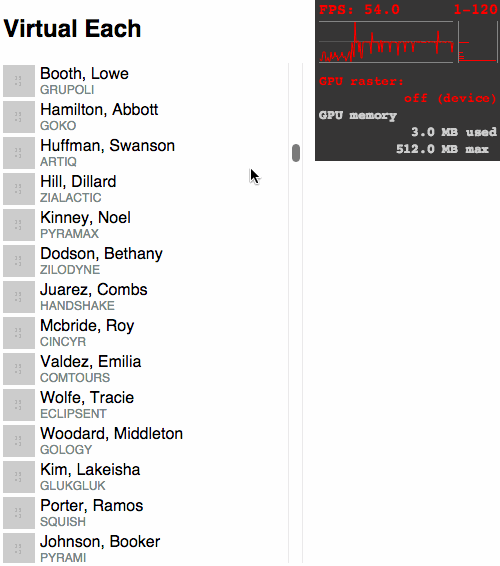

# virtual-each
[](http://emberobserver.com/addons/virtual-each)
[![Ember badge][ember-badge]][embadge]

[](https://travis-ci.org/jasonmit/virtual-each)
[](https://david-dm.org/jasonmit/virtual-each)
[](https://david-dm.org/jasonmit/virtual-each#info=devDependencies)

A direct port of react-infinite-list to Ember.  This was created as a benchmark exercise.

This component will only ever render DOM nodes for what can fill the view port.  Using the power of Glimmer, it will reuse the DOM nodes it's already created and swap out the content as the user scrolls.

If you want a more flexible virtualization component, please try [ember-collection](https://github.com/emberjs/ember-collection).

## Install

`ember install virtual-each`

## Usage

```hbs
{{#virtual-each items
  height=200
  itemHeight=36
  onScrollBottomed=(action 'handlePageBottom')
  positionIndex=0
  as |item actualIndex virtualIndex|
}}
  <div class="person-row">
    
    <div>
      <div>{{actualIndex}}. {{item.name.last}}, {{item.name.first}}</div>
      <div class="company">{{item.company}}</div>
    </div>
  </div>
{{else}}
  <strong>No results</strong>
{{/virtual-each}}
```

### Attributes

* `height`: fixed height of the component (required)
* `itemHeight`: fixed row height (required)
* `onScrollBottomed`: invoked when scrolled to the bottom of the list (optional)
* `positionIndex`: start at or scroll to a specific item based on the item index (optional)

## CSS

Add the following CSS snippet to `styles/app.css`:

```css
.virtual-each {
  overflow-y: auto;
}

.infinite-list-content {
  list-style: none;
  margin: 0;
  padding: 0;
}
```

## Known "Gotchas"

* Not defining an `itemHeight`, or defining a less-than expected height, will result in unexpected jumping behavior during scrolling.  `itemHeight` should be set to _exact_ height of a row.

## Demo



## Requirements

* Ember >= 1.13.0

## Contributing

### Install

* `git clone` this repository
* `npm install`
* `bower install`
* `ember server`
* Visit your app at http://localhost:4200.

### Running Tests

* `ember test`
* `ember test --server`

[embadge]: http://embadge.io/
[ember-badge]: http://embadge.io/v1/badge.svg?start=1.13.0
